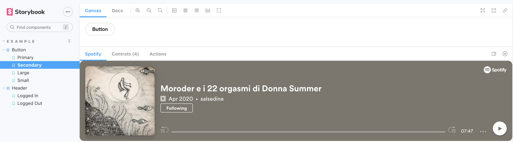

# Storybook Addon Spotify

The [Storybook Addon Spotify](https://storybook.js.org/addons/storybook-spotify/) is used to easily embed a Spotify iframe to display any of all available types of content, as a playlist, an album, a song, a podcast or an episode within a [Storybook](https://storybook.js.org) panel.
## Installation

```sh
npm install storybook-spotify --save-dev
```

## Basic Setup

Add the following code in the `main.js` of your Storybook configuration:

```js
module.exports = {
  addons: ['storybook-spotify'],
};
```

Set the parameters of your story with the key value `version` in order to provide the necessary information to be displayed.

**Configuration**

| Property | Required | Type of Value | Description | Example |
|---|---|---|---|---|
| url | ✔ | string | Spotify source | https://open.spotify.com/playlist/4gV0IA40bGoAG1Rla7oZzQ?si=c9730ce8d8f349d3 |

**Implementation**

```js
export const parameters = {
  spotify: {
    url: 'https://open.spotify.com/embed/playlist/4gV0IA40bGoAG1Rla7oZzQ?si=c9730ce8d8f349d3'
  }
}
```

## Story Setup Example

Add the `version` parameter in the default Story configuration:

```js
import React from 'react'

export default {
  title: 'Component Button',
  parameters: {
    spotify: {
      url: 'https://open.spotify.com/embed/playlist/4gV0IA40bGoAG1Rla7oZzQ?si=c9730ce8d8f349d3'
    }
  }
}
```

## Examples



